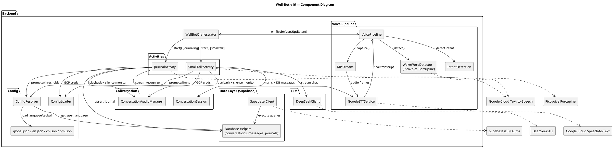

### Well-Bot v16 — System Implementation Overview

This document summarizes the repository’s architecture, key components, runtime flow, configurations, and external dependencies. It also includes a PlantUML component diagram of the system.

### High-level Architecture

- Orchestration: `backend/main.py` boots the system and coordinates state transitions: wake word → STT/intent → activity routing → activity run → restart wake word.
- Core components (in `backend/src/components/`): wake word detection, microphone streaming, STT, TTS, conversation session/logging, audio playback/silence monitoring, and intent detection.
- Activities (in `backend/src/activities/`): feature modules implementing user-facing flows. Implemented: `SmallTalkActivity`, `JournalActivity`.
- Configuration: language- and global-level config in `backend/config/*.json`, resolved per-user via `utils/config_resolver.py` with caching.
- Data layer: Supabase client and DB helpers in `backend/src/supabase/` for conversations, messages, and journals.
- External services: Picovoice Porcupine (wake word), Google Cloud Speech-to-Text, Google Cloud Text-to-Speech, DeepSeek LLM, and Supabase.

### Runtime Flow (Typical Session)

1) Startup
- `WellBotOrchestrator` validates wake word model, resolves user and language, initializes: STT, TTS, wake word pipeline, and activities.

2) Idle Listening
- `VoicePipeline` starts `WakeWordDetector` (Porcupine) to detect the custom keyword. Optional audio cue + TTS prompt on detection.

3) After Wake Word
- Microphone capture begins (`MicStream`); `GoogleSTTService` streams recognition. Final transcript triggers lightweight phrase-based intent detection from language config; orchestrator routes to `smalltalk` or `journaling`.

4) Activity Execution
- SmallTalk: coordinated by `SmallTalkActivity` using `ConversationAudioManager` (playback + mic mute/unmute + silence monitoring), `ConversationSession` (turns and DB messages), DeepSeek LLM via `components/llm.py` for streaming tokens, and Google TTS for speaking responses.
- Journal: `JournalActivity` captures speech continuously, detects termination phrases and long pauses, buffers paragraphs, then saves to Supabase as a journal entry. Provides prompts and confirmations via TTS and optional audio assets.

5) Cleanup and Return
- Each activity cleans its resources, optionally reinitializes for next run, and hands control back to orchestrator which restarts the wake word pipeline.

### Core Components and Responsibilities

- `components/wakeword.py` (Picovoice Porcupine): continuous keyword detection, mic stream frame management.
- `components/_pipeline_wakeword.py` (`VoicePipeline`): binds wake word → STT → intent, plays feedback cues/prompts, coordinates timeouts and callbacks back to orchestrator.
- `components/mic_stream.py` (`MicStream`): thread-safe buffered mic capture with mute/unmute and cleanup.
- `components/stt.py` (`GoogleSTTService`): Google Cloud Speech streaming with interim/final callbacks; termination aware.
- `components/tts.py` (`GoogleTTSClient`): Google Cloud TTS streaming PCM chunks and fallback batch synthesis; WAV writer helper.
- `components/conversation_audio_manager.py`: unified playback of audio/TTS, mic muting/unmuting, silence monitoring with nudge/timeout callbacks.
- `components/conversation_session.py`: turn counting, session lifecycle, message persistence to DB.
- `components/intent_detection.py`: phrase-based intent detection using normalized text and per-language config.
- `components/llm.py` (`DeepSeekClient`): streaming and non-streaming chat against DeepSeek API (OpenAI-compatible endpoint semantics).

### Activities

- `activities/smalltalk.py` (`SmallTalkActivity`): composes `MicStream` + `GoogleSTTService` + `ConversationAudioManager` + `ConversationSession` + `DeepSeekClient` + Google TTS. Handles termination phrases, start/end prompts, silence nudges, and DB message logging.
- `activities/journal.py` (`JournalActivity`): continuous capture, paragraph buffering, language-aware word/character thresholds, termination phrase detection, inactivity nudge/timeout, and Supabase persistence via `database.upsert_journal`.

### Configuration and Assets

- `backend/config/global.json`: numerical and behavioral settings (timeouts, thresholds, language code mapping for TTS/STT).
- `backend/config/{en,cn,bm}.json`: language-specific settings, including audio asset paths, prompts, and intent phrases.
- `assets/BAHASA|ENGLISH|MANDARIN`: WAV files for start/nudge/termination cues per language.
- `utils/config_loader.py`: loads env (.env), external service configs (DeepSeek, Supabase, Google), creates temp GCP credentials JSON; validates required env.
- `utils/config_resolver.py`: per-user language resolution via Supabase (cached), loads language config, and overlays `global.json` language codes.

### Data Layer (Supabase)

- `supabase/client.py`: creates Supabase client (service or anon) from env; helper to fetch users.
- `supabase/database.py`: operations for users, conversations (`wb_conversation`), messages (`wb_message`), and journals (`wb_journal`).
- `supabase/schemas.sql`: schema definitions (reference for table structures).

### External Services

- Wake word: Picovoice Porcupine (local, requires `PORCUPINE_ACCESS_KEY` and `.ppn` keyword file).
- STT: Google Cloud Speech-to-Text (streaming).
- TTS: Google Cloud Text-to-Speech (streaming PCM; fallback batch).
- LLM: DeepSeek Chat API for response generation in smalltalk.
- Database: Supabase (cloud Postgres + REST), used for user prefs, conversations, messages, journals.

### Deployment

- `Dockerfile` + `compose.yaml` run the backend (`python backend/main.py`). Access to audio devices is passed through (`/dev/snd`), and `.env` is loaded from `backend/.env`. Ports can be exposed (compose maps 8000:8000 though the backend is a CLI/daemon).

### Component Diagram (PlantUML)

### Notable Behaviors and Safeguards

- Windows audio timing: guard delays and teardown checks when transitioning between wake word and activities to avoid device contention.
- Silence handling: `ConversationAudioManager` starts monitoring as activities begin; calls back to play nudge or finalize with timeout.
- Termination-aware STT: transcript callbacks can raise a termination signal which is intentionally re-raised by STT to be handled by activities.
- Language-aware thresholds: Chinese uses character counts; others use words for journal save thresholds.

### Quick Inventory

- Entrypoint: `backend/main.py` (`WellBotOrchestrator`).
- Components: `wakeword.py`, `_pipeline_wakeword.py`, `mic_stream.py`, `stt.py`, `tts.py`, `conversation_audio_manager.py`, `conversation_session.py`, `intent_detection.py`, `llm.py`.
- Activities: `activities/smalltalk.py`, `activities/journal.py`.
- Config: `config/global.json`, `config/{en,cn,bm}.json`.
- Assets: language audio prompts in `backend/assets/**`.
- Data: `src/supabase/{auth,client,database}.py`, `schemas.sql`.

